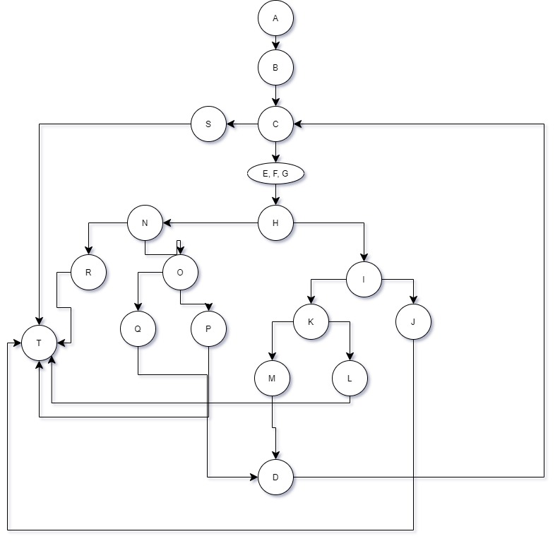

# Втора лабораториска вежба по Софтверско инженерство
## Андреј Антевски, бр. на индекс 186013
### Група на код
Ја добив групата на код 6
### Control Flow Graph

### Цикломатска комплексност
Цикломатската комплексност на овој код е 7, истата ја добив преку формулата број на ребра - број на јазли + 2.
Имам вкупно 18 јазли и 23 ребра па со замена во формулата 23-18+2 = 7 ја добив цикломатската комплексност
### Тест случаи според критериумот Every path
ABCST Не ни влегува во циклусот, затоа што е празна листата  
ABCEFGHNRT Фрла RuntimeException("The angle is smaller or greater then the minimum")  
ABCEFGHNOQT Фрла RuntimeException("The angle is greater then the maximum")  
ABCEFGHIJT Фрла RuntimeException("The minutes of the angle are not valid!")  
ABCEFGHIKLT Фрла RuntimeException("The seconds of the angle are not valid")  

ABC(EFGHNOPDC)ST Сите агли се точно 360 степени  
ABC(EFGHIKMDC)ST Сите агли се помеѓу 0 и 360 степени, со 0  

комбинации и од двете 

Неколку агли од по 360 степени и некој невалиден агол соодветно  
ABC(EFGHNOPDC)EFGHNRT  
ABC(EFGHNOPDC)EFGHNOQT  
ABC(EFGHNOPDC)EFGHIJT  
ABC(EFGHNOPDC)EFGHIKLT  
Неколку агли помеѓу 0 и 360 степени и некој невалиден агол соодветно  
ABC(EFGHIKMDC)EFGHNRT  
ABC(EFGHIKMDC)EFGHNOQT  
ABC(EFGHIKMDC)EFGHIJT  
ABC(EFGHIKMDC)EFGHIKLT  
### Тест случаи според критериумот Мultiple condition

CONDITION; COMBINATIONS; BRANCHES  
(deg >= 0 && deg < 360); TT, TF, FX; (H-I), (H-N), (H-N)  
(min < 0 || min > 59); TX, FT, FF; (I-J), (I-J), (I-K)  
(sec < 0 || sec > 59); TX, FT, FF; (K-L), (K-L), (K-M)  
(min == 0 && sec == 0); TT, TF, FX; (O-P), (O-Q), (O-Q)  

### Објаснување на напишаните unit tests
##### Every path
За Every path критериумот тестовите ги напишав така што ќе се оди по секоја патека. Таму каде што може да има повторување,
проверив за секоја можна комбинација:  
dа немаме RuntimeException и аголот да е точно 360 степени, да немаме RuntimeException и аголот да е под 360 степени, но валиден, 
комбинации од двете, првиот агол веднаш да е фрла исклучок, како и да имаме валиден агол по што ќе следи некој погрешен што ќе фрли исклучок.
##### Multiple condition
За Multiple condition тестовите ги направив така да еден е валиден тест, односно сите агли се валидни, со што неколку комбинации
беа исполнети. Потоа ги направив тестовите за тоа да не е валидно во степенот, па во минутите, па во секундите, каде што се 
фрла соодветен исклучок